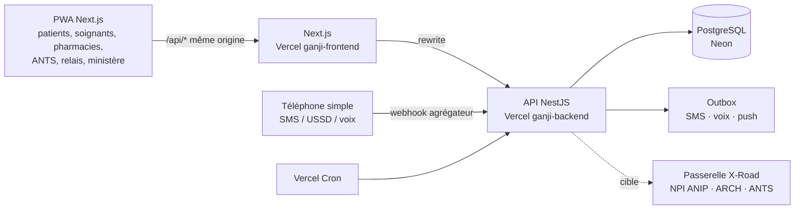

# Architecture de Ganji

## Vue d'ensemble

Les canaux (web, SMS, USSD, voix) passent **tous par la même API** : une seule logique métier et un seul contrôle d'accès (`AccessService`).

## Dépôts

| Dépôt | Rôle | Stack |
|-------|------|-------|
| `ganji-frontend` | PWA, 7 espaces par profil, simulateur de téléphone, page de suivi du chantier | Next.js 15, React 19, Tailwind 4, Leaflet, qrcode |
| `ganji-backend` | API REST documentée (OpenAPI sur `/docs`), 13 modules métier, seed réel + fictif | NestJS 11, Prisma 6, PostgreSQL 16 |

## Modules de l'API

| Module | Cahier | Points clés |
|--------|--------|-------------|
| `auth` | M1 | OTP SMS haché, 5 essais, sessions courtes pour les soignants, comptes de démo |
| `patients` | M1, M2 | Consentements, QR / code 24 h, journal d'accès, aidants, fiche vitale, chronologie, courbes, documents |
| `care-map` | M11 | Arbre d'orientation rejoué côté serveur, lieux de soin les plus proches |
| `blood` | M4 | Vérification des stocks compatibles, appel ciblé (groupe, distance, délai depuis le dernier don), réponse par app / SMS / USSD |
| `medications` | M5 | Recherche publique, ordonnance signée HMAC, délivrance atomique à usage unique |
| `emergency` | M7 | Carte QR publique minimale, bris de glace motivé et notifié, SOS |
| `maternal` | M10 | 4 CPN, signes de danger → relais + maternité, calendrier PEV, preuve de vaccination signée |
| `care` | M3, M6 | Plan de soins, rappels, journal de symptômes avec alerte équipe, télé-expertise asynchrone |
| `alerts` | M13 | Alertes géolocalisées, signalement communautaire, détection de regroupements (≥ 3 en 7 jours) |
| `dashboard` | M9 | Agrégats anonymisés, seuil de 10 par cellule |
| `channels` | 5 sans | Simulateur SMS et USSD, tâche planifiée des rappels |

## Modèle de données (aligné sur FHIR R4)

`Patient`, `RelatedPerson` (Delegation), `Practitioner`, `CareTeam`, `Organization`/`Location` (Facility, Commune, Department), `Encounter`, `Observation`, `Condition`, `DocumentReference`, `CarePlan`, `Appointment` (Reminder), `Consent`, `AuditEvent`, `ServiceRequest` (BloodRequest, TeleExpertise), `MedicationRequest` + `MedicationDispense` (Prescription), `EpisodeOfCare` (Pregnancy), `Immunization`, `Communication` (HealthAlert, Outbox). Voir `ganji-backend/prisma/schema.prisma`.

## Écarts assumés pour la démo serverless

| Cahier | Démo | Production (datacenter national) |
|--------|------|-----------------------------------|
| Redis + BullMQ | Table `Outbox` + Vercel Cron | Redis + BullMQ, workers |
| PostGIS | Haversine en TypeScript | `ST_DWithin` indexé |
| Temps réel | Polling 3 s | SSE / WebSocket |
| Agrégateur SMS, serveur vocal | Simulateur intégré (`/simulateur`) | Agrégateur national, IVR |
| X-Road, ANIP, ARCH, DondeSang | Simulés (NPI au format ANIP) | Services X-Road Bénin |
| Voix en langues nationales | Pipeline prêt (`/audio/<langue>/<clé>.mp3`), français par synthèse | Enregistrements par des locuteurs natifs |

## Passage à l'échelle (13 millions d'habitants)

API sans état (horizontal), connexions poolées, index sur les requêtes chaudes, file de tâches pour les envois, déploiement par département (pilote Littoral-Atlantique puis extension), hébergement des données de santé au Bénin.
