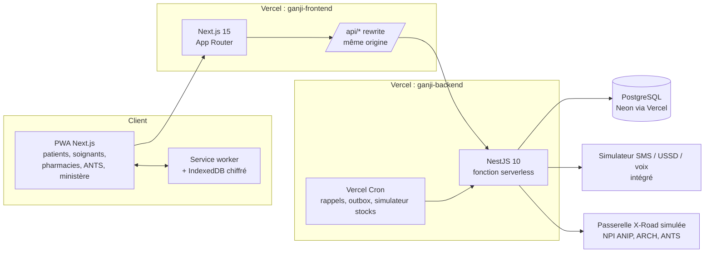

# Ganji : plan de conception détaillé

> Document de référence du chantier. Il traduit le cahier des charges (`docs/CAHIER_DES_CHARGES.pdf`) en décisions d'architecture, en contrats d'API et en chantiers livrables, chacun avec ses critères d'acceptation.
> Suivi en direct : page `/chantier` de l'application (générée depuis `docs/progress.json`).

---

## 1. Principes directeurs

| # | Principe | Conséquence concrète |
|---|----------|----------------------|
| P1 | **Le parcours héros d'abord** (Koffi a besoin de plaquettes) | Chaque chantier garde le parcours démontrable de bout en bout ; rien n'est « à moitié branché ». |
| P2 | **Règle des 5 sans** : sans réseau, sans smartphone, sans savoir lire, sans argent immédiat, sans compte | Tout écran patient a une icône, un bouton « écouter », un repli hors ligne ; chaque action critique a un équivalent SMS dans le simulateur. |
| P3 | **Aucune donnée de santé lue sans consentement ou motif d'urgence tracé** | Vérification côté serveur à chaque requête (garde `ConsentGuard`) ; journal d'accès en ajout seul, visible par le patient. |
| P4 | **Public = réel, personnel = fictif** | Établissements, communes, médicaments essentiels, calendrier vaccinal : réels. Patients, soignants, stocks : fictifs, générés par le seed. Bandeau « Données fictives : démonstration » permanent. |
| P5 | **Une seule logique métier** | Web, SMS et voix passent par la même API et le même contrôle d'accès. |
| P6 | **Livrer petit, livrer souvent** | Un commit + push sur `develop` à la fin de chaque module fonctionnel. `main` ne bouge que sur demande explicite. |

---

## 2. Architecture cible (démo) : deux dépôts, deux projets Vercel

**Pourquoi deux dépôts :** le déploiement demandé se fait sur Vercel en deux projets séparés (frontend et backend). Chaque dépôt a sa CI, son README et sa propre URL.

**Pourquoi le rewrite `/api/*` :** le navigateur ne parle qu'au domaine du frontend. Les cookies de session (`HttpOnly`, `Secure`, `SameSite=Lax`) restent *first-party*, sans CORS permissif ni cookie tiers.

### Adaptations au serverless (écarts assumés par rapport au cahier)

| Cahier | Démo sur Vercel | Cible production (datacenter national) |
|--------|-----------------|------------------------------------------|
| Redis + BullMQ | Table `Outbox` dans PostgreSQL + Vercel Cron toutes les minutes + envoi immédiat best-effort | Redis + BullMQ, workers dédiés |
| Temps réel | Polling léger (3 s) sur les écrans « demande de sang » et « simulateur SMS » | SSE / WebSocket |
| Render / Railway | Vercel (2 projets) + Neon | Conteneurs Docker (Compose fourni) |
| PostGIS | Distance haversine en SQL (index lat/lng) | PostGIS `ST_DWithin` |

---

## 3. Stack

| Couche | Choix | Détail |
|--------|-------|--------|
| Frontend | Next.js 15 (App Router, React 19), Tailwind CSS 4 | Server Components pour un JS initial < 100 Ko ; composants client uniquement là où il faut interagir. |
| PWA | `sw.js` écrit à la main + `manifest.webmanifest` | Cache-first pour la coque, network-first pour l'API, file de synchronisation (Background Sync, avec repli sur `online`). |
| Stockage local | IndexedDB, AES-GCM (WebCrypto), clé dérivée du PIN (PBKDF2, 310 000 itérations) | Fiche vitale, carte QR, rappels, carnet résumé. |
| Cartes | Leaflet + tuiles OpenStreetMap | Chargées à la demande (import dynamique). |
| Backend | NestJS 10, Prisma 5, `class-validator` | Modules par domaine, guards `Roles` + `Consent`, Swagger sur `/docs`. |
| Base | PostgreSQL 16 (Neon) | Migrations Prisma versionnées ; seed idempotent. |
| Sécurité | Helmet, CSP stricte, rate limiting (`@nestjs/throttler`), AES-256-GCM par champ, NPI haché (HMAC-SHA256) | Voir `SECURITY.md`. |
| Tests | Vitest (logique métier, garde de consentement), Supertest (autorisations, IDOR), Playwright + axe-core (parcours, accessibilité) | Couverture visée ≥ 70 % sur les services. |
| CI | GitHub Actions : lint, typecheck, tests, `npm audit`, gitleaks, CodeQL | Badge dans les README. |

---

## 4. Modèle de données (aligné sur FHIR)

| Entité Prisma | Ressource FHIR | Champs clés | Sensibilité |
|---------------|----------------|-------------|-------------|
| `User` | — | id (UUID), role, npiHash, npiLast4, phone, lang, simpleMode | NPI jamais en clair |
| `Patient` | Patient | birthDate, sex, bloodGroup, allergies, emergencyContact, communeId, qrToken | Fiche vitale |
| `Delegation` | RelatedPerson | caregiverId, patientId, scopes[], expiresAt | — |
| `Practitioner` | Practitioner | specialty, facilityId, orderNumber, verifiedAt | Validé par un admin |
| `Facility` | Organization + Location | name, type (hôpital, CS, pharmacie, site de transfusion), lat, lng, communeId, services[], open24h, onDuty | **Réel** |
| `Department`, `Commune` | Location | 12 départements, 77 communes | **Réel** |
| `Encounter` | Encounter | type, date, facility, summary* | *chiffré |
| `Observation` | Observation | code (HB, PLT, GLY, TA…), value, unit, date | chiffré (note) |
| `Condition` | Condition | code, label*, category (standard / très sensible) | *chiffré ; compartiment séparé |
| `Document` | DocumentReference | kind, mime, size, blob (compressé ≤ 300 Ko) | — |
| `CarePlan`, `Appointment`, `Reminder` | CarePlan, Appointment | nextAt, channel (app, SMS, voix), confirmedAt | — |
| `SymptomLog` | Observation | pictogram, severity, alert | — |
| `Consent` | Consent | patientId, granteeId, scopes[], expiresAt, revokedAt, source (QR, code, équipe) | — |
| `AuditEvent` | AuditEvent | actorId, patientId, action, resource, reason, allowed, at | **Ajout seul** (trigger SQL) |
| `BloodSite`, `BloodStock` | Location + (entité propre) | siteId, product (CGR, plaquettes, plasma), group, units | Stocks fictifs |
| `BloodRequest` | ServiceRequest | product, group, qty, urgency, status, facilityId | — |
| `Donor`, `DonorAlert` | (entité propre) + Communication | group, lat, lng, lastDonationAt, available ; alert status, channel, rdvAt | — |
| `Medication` | Medication | DCI, forme, dosage | **Réel** (liste essentielle) |
| `PharmacyStock` | (entité propre) | pharmacyId, medicationId, qty, price | Fictif |
| `Prescription` | MedicationRequest + MedicationDispense | items, signature (HMAC), status, dispensedAt, dispensedBy | Usage unique |
| `TeleExpertise` | ServiceRequest + Communication | specialty, question, attachments, urgency, answer, answeredAt | — |
| `Pregnancy`, `AncVisit` | EpisodeOfCare, Encounter | lmp, edd, dangerSigns | — |
| `Immunization` | Immunization | vaccineCode, dueAt, givenAt, lot | Calendrier PEV **réel** |
| `HealthAlert` | Communication | communes[], kind, severity, message, audio | — |
| `CommunityReport` | Observation (communautaire) | relayId, communeId, syndrome, cases | — |
| `Outbox` | Communication | channel, to, lang, body, status, sentAt | Jamais de donnée médicale dans le corps |

---

## 5. Contrat d'API (extrait, documentation complète sur `/docs`)

| Domaine | Endpoints | Garde |
|---------|-----------|-------|
| Auth (M1) | `POST /auth/otp/request` · `POST /auth/otp/verify` · `POST /auth/demo/:persona` · `POST /auth/logout` · `GET /me` | rate limit 5/min/IP |
| Consentement (M1) | `GET/POST/DELETE /consents` · `POST /share/qr` · `POST /share/redeem` · `GET /me/access-log` | patient propriétaire |
| Carnet (M2) | `GET /patients/:id/summary` · `/timeline` · `/observations` · `POST /documents` | `ConsentGuard` |
| Soins (M3) | `GET/POST /careplans` · `/reminders` · `POST /symptoms` | équipe de soins |
| Sang (M4) | `POST /blood/requests` · `GET /blood/stocks` · `POST /blood/requests/:id/alert-donors` · `POST /donors/respond` | soignant, ANTS |
| Médicaments (M5) | `GET /medications/search?q=` · `GET /pharmacies/nearby` · `POST /prescriptions` · `POST /prescriptions/:id/dispense` | pharmacien vérifié |
| Télé-expertise (M6) | `POST /tele-expertise` · `POST /tele-expertise/:id/answer` | soignant |
| Urgence (M7) | `GET /emergency/:qrToken` (public, fiche minimale) · `POST /emergency/break-glass` · `POST /sos` | journalisé, patient notifié |
| Pilotage (M9) | `GET /dashboard/national` (agrégats, seuil ≥ 10) | rôle ministère |
| Mère-enfant (M10) | `GET/POST /pregnancies` · `POST /pregnancies/:id/danger-signs` · `GET /children/:id/immunizations` | patient, relais |
| Orientation (M11) | `POST /triage` (public, anonyme) · `GET /facilities/nearby` | public |
| Alertes (M13) | `GET /alerts?commune=` · `POST /community-reports` | public, relais |
| Canaux | `POST /sms/inbound` · `GET /sms/outbox` (simulateur) · `POST /ussd` | signature du webhook |

---

## 6. Sécurité : traduction du cahier en code

| Menace | Mesure implémentée | Où |
|--------|--------------------|----|
| Soignant curieux | `ConsentGuard` : rôle **et** consentement actif **ou** membre de l'équipe **ou** bris de glace ; sinon 403 + `AuditEvent(allowed=false)` | `backend/src/common/guards/consent.guard.ts` |
| IDOR | UUID v4 partout ; l'appartenance est vérifiée dans chaque service ; tests Supertest dédiés | `test/authz.e2e-spec.ts` |
| Fuite de base | AES-256-GCM par champ (diagnostics, notes, résultats) ; NPI en HMAC-SHA256 + 4 derniers chiffres | `common/crypto` |
| Fausse ordonnance | QR = `id.signature` (HMAC-SHA256, clé serveur) ; statut `DISPENSED` atomique (transaction) | `prescriptions.service.ts` |
| Vol de compte | OTP 6 chiffres haché, 5 essais, expiration 5 min ; alerte « nouvelle connexion » ; session soignant 30 min | `auth` |
| Injection / XSS | Prisma paramétré ; `ValidationPipe({ whitelist, forbidNonWhitelisted })` ; CSP stricte côté Next | — |
| Journal falsifié | Trigger PostgreSQL qui refuse `UPDATE` / `DELETE` sur `AuditEvent` | migration SQL |
| SMS qui divulgue | Le corps d'un SMS ne contient jamais de donnée médicale : seulement un code ou un lien | `outbox.service.ts` |
| Téléphone perdu | Stockage local chiffré par PIN ; mode discret ; QR d'urgence sans détail | frontend `lib/secure-store.ts` |

---

## 7. Design system (inspiré des références fournies)

Les deux planches de référence (CliniQ, Beefit) donnent le ton : cartes très arrondies (24 px), fond clair légèrement teinté, grands chiffres, un bouton principal sombre pleine largeur, puces d'action rondes. Adaptation Ganji :

| Jeton | Valeur | Usage |
|-------|--------|-------|
| `--brand-900` | `#0B4F3C` (vert profond) | Bouton principal, titres, contraste AA sur blanc (9,6:1) |
| `--brand-100` | `#E3F1EB` | Fonds de cartes, sélection (comme le jour sélectionné de CliniQ) |
| `--accent` | `#D99A1E` (jaune ocre) | Rappels, actions secondaires, badges |
| `--danger` | `#C62828` | **Uniquement** urgence et sang |
| `--surface` | `#F5F7F6` | Fond d'application |
| Typo | Atkinson Hyperlegible, 18 px minimum côté patient | Lisibilité pour les malvoyants |
| Rayons | 24 px (cartes), 999 px (puces, boutons ronds) | — |
| Cibles tactiles | ≥ 48 px | Handicap moteur |

Trois densités : **simple** (4 grosses tuiles), **standard**, **expert** (soignant, ministère). Thème sombre (écrans OLED, mode économie).

Écrans prioritaires : accueil patient (4 tuiles + prochain RDV), carte d'urgence QR plein écran, fiche patient soignant, demande de sang avec compteur de donneurs en direct, tableau de bord national.

---

## 8. Chantiers, livrables et critères d'acceptation

Chaque chantier se termine par un commit `feat(<module>): …` et un push sur `develop` dans le ou les dépôts concernés, puis par la mise à jour de `docs/progress.json`.

| # | Chantier | Modules | Livrable | Critère d'acceptation (vérifié avant commit) |
|---|----------|---------|----------|----------------------------------------------|
| C0 | Socle | — | 2 dépôts, CI, Helmet/CSP, Prisma, seed réel + fictif, auth OTP + comptes de démo | `npm test` vert ; `/health` répond ; connexion par persona en 1 clic |
| C1 | Identité, consentement, carnet | M1, M2 | Consentements, QR de partage 24 h, journal d'accès, fiche vitale, chronologie, courbes d'analyses | Un soignant sans consentement reçoit 403 et la tentative apparaît au journal du patient |
| C2 | Orientation et carte | M11 | Triage par pictogrammes sans compte, carte des lieux de soin et pharmacies de garde | Sans compte, on obtient une orientation et le lieu ouvert le plus proche |
| C3 | Sang | M4 | Demande, stocks sur carte, appel ciblé aux donneurs, simulateur SMS | Un donneur répond « 1 » dans le simulateur et la demande passe à « donneur trouvé » en direct |
| C4 | Médicaments | M5 | Ordonnance signée (QR), « Qui a mon médicament ? », délivrance tracée | Une ordonnance déjà délivrée est refusée à la 2e pharmacie |
| C5 | Urgence | M7 | Carte QR hors ligne, bris de glace justifié, SOS | La carte d'urgence s'affiche en mode avion |
| C6 | Mère et enfant | M10 | Suivi de grossesse (4 CPN), signes de danger, carnet de vaccination PEV | Un rappel de CPN et un rappel de vaccin partent par SMS et par message vocal |
| C7 | Alertes et pilotage | M13, M9 | Alertes géolocalisées, signalement relais en 3 gestes, tableau de bord national | Trois signalements dans une commune déclenchent une alerte au médecin chef de zone |
| C8 | Suivi chronique et télé-expertise | M3, M6 | Plan de soins, rappels multicanal, journal de symptômes, avis asynchrone | Une question envoyée depuis Djougou reçoit une réponse écrite visible dans le carnet |
| C9 | Inclusion | — | Audio fon / yoruba / bariba / dendi, mode simple, mode discret, i18n FR/EN | Messages vocaux dans au moins 2 langues nationales ; axe-core sans violation critique |
| C10 | Hors ligne et performance | — | Service worker, file de synchronisation, budget de poids | Première page < 200 Ko ; Lighthouse a11y ≥ 95 sur les écrans patients |
| C11 | Étendue | M8, M12, M14, M15 | Maquettes cliquables : assistant, écoute anonyme, droits et paiement, cercle de soin | Parcours cliquables, marqués « aperçu » |
| C12 | Qualité et livraison | — | Tests Playwright des parcours, `SECURITY.md`, `ARCHITECTURE.md`, README, déploiement | CI verte ; liens accessibles ; mail envoyé |

### Calendrier de ce soir (heure de Cotonou)

| Créneau | Chantiers |
|---------|-----------|
| 17:00 – 18:00 | C0 socle (dès que npm est accessible) |
| 18:00 – 19:00 | C1 · C2 |
| 19:00 – 20:30 | C3 · C4 · C5 (parcours héros complet) |
| 20:30 – 21:30 | C6 · C7 |
| 21:30 – 22:15 | C8 · C9 |
| 22:15 – 23:00 | C10 · C11 |
| 23:00 – 23:45 | C12, déploiement, vérification des liens, envoi du mail |

---

## 9. Données de démonstration

| Donnée | Nature | Source | État |
|--------|--------|--------|------|
| 12 départements, 77 communes | Réelle | Découpage administratif officiel | Intégré au seed |
| Établissements (CNHU-HKM, HOMEL, CHUD, hôpitaux de zone…) | Réelle (noms, communes) | Liste publique ; positions GPS à affiner par import Healthsites / OSM (`scripts/import-healthsites.ts`) | Intégré au seed |
| Sites de transfusion | Réelle (liste), stocks fictifs | ANTS / services départementaux | Intégré au seed |
| Médicaments | Réelle | Liste des médicaments essentiels (OMS / LNME Bénin) | Intégré au seed |
| Calendrier vaccinal | Réel | Programme élargi de vaccination (PEV) du Bénin | Intégré au seed |
| Patients, soignants, donneurs, ordonnances | Fictive | Script `seed` : noms béninois, NPI au format ANIP (10 chiffres), groupes sanguins selon des fréquences plausibles | 1 patient héros + 200 patients, 30 soignants, 500 donneurs |

### Comptes de démo (connexion en un clic sur `/demo`)

| Persona | Rôle | Ce qu'on montre |
|---------|------|-----------------|
| Koffi (34 ans, leucémie, Abomey-Calavi) | Patient | Carnet, QR, consentements, journal d'accès |
| Afiavi (sa mère) | Aidante | Délégation, voix en fon |
| Dr Houngbédji (CNHU-HKM) | Hématologue | Fiche patient, demande de plaquettes, réponses d'avis |
| Rachidatou (CS Djougou) | Infirmière | Télé-expertise |
| Pharmacie de garde, Parakou | Pharmacien | Délivrance, stock |
| ANTS, site de Cotonou | Banque de sang | Stocks, appels aux donneurs |
| Direction de la santé publique | Ministère | Tableau de bord national |
| Mathieu | Relais communautaire | Signalement en 3 gestes |
| Rafiatou (Kandi, 1re grossesse) | Patiente | Suivi de grossesse, rappel en bariba |

---

## 10. Workflow Git

- `main` : branche de livraison, **gelée** jusqu'à demande explicite.
- `develop` : intégration continue, un commit par chantier terminé et vérifié.
- Messages de commit conventionnels : `feat(m4-sang): appel ciblé aux donneurs + simulateur SMS`.
- Aucun secret dans le dépôt : `.env.example` seulement ; scan gitleaks en CI.
